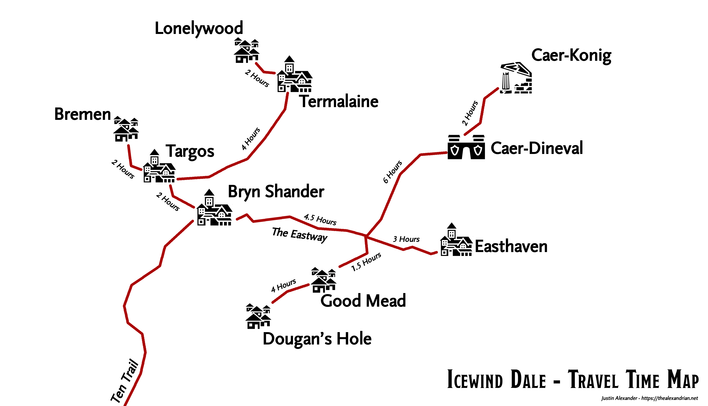

# Table of Contents
- [Summary](#summary)
- [Party](#party)
- [Quests](#quests)
- [Completed Quests](#completed-quests)
- [Locations](#locations)
- [People](#people)
- [Legends](#legends)
- [Groups](#groups)
- [Creatures](#creatures)
- [Concepts](#concepts)
- [Magic Items](#magic-items)
- [Games](#games)

# Summary
## Session #1
- The party meets in [Bryn Shander](#bryn-shander) in the [Ten Towns](#ten-towns)
- The party takes a [quest](#quests) to [Investigate Sephek's Murders](#sepheks-murders), from [Hjoln](#hjoln) at [The Northlook](#the-northlook)
- The party takes another [quest](#quests) to [find twingas](#find-twingas), from [Dannica Greysteel](#dannica-greysteel) in the center of [Bryn Shander](#bryn-shander)
- The party sets out from [Bryn Shander](#bryn-shander), and runs into [Torga's Caravan](#toargs-caravan)
- [Torga](#torrga-icevien) talks to the party, and brings [Sephek](#sephek-kaltro) to the party, who observes that he appears to not be breathing
- The party arrives in [Goodmead](#goodmead) after confronting [Torga's Caravan](#toargs-caravan)
- The party finds out about some [missing mead](#missing-mead), from [Feff](#feff-morrin) in [Goodmead](#goodmead)
- The party sets off to the northwest to try and find the [verbeeg](#verbeeg) who [stole the mead](#missing-mead)
- [Sven](#sven) finds a fox in the woods to the northwest
- The party meets a couple [twinga](#twinga) in the woods, which rode the fox
- Party finds from [5 corpses in the forests](#missing-mead) of [Goodmead](#goodmead):
    - 2 shortswords
    - 2 hammers
    - handaxe

## Session #2
- The party tracked the [verbeeg](#verbeeg) down to a cave about 2 hours outside of [Goodmead](#goodmead)
- The party goes into the [verbeeg](#verbeeg) lair and fights a [verbeeg](#verbeeg) and a bear
- The bear kind of fucks up the entire party
    - [Sven](#sven) and [Brynn](#brynn) get knocked down
    - [Chroneer](#chroneer) casts sleep on the bear to save the fight
    - [Sven](#sven), [Chroneer](#chroneer), and [Pillby](#pillby) stab the bear in the neck together and murder it
- The party takes a short rest to recover
- The party finds a tomb in the verbeeg cave
- The party discovers a cheiftan holding a [pearl orb](#pearl-of-power) and a [wand](#wand-of-the-warmage), which are both magical, which [Chroneer](#chroneer) takes out of curiosity
    - The pearl was a [Pearl of Power](#pearl-of-power), which goes to [Pillby](#pillby)
    - The wand was a [Wand of the Warmage](#wand-of-the-warmage)
- [Chroneer](#chroneer) sees a vision of an undead face
- The party fills up their canteens with water from a pool in the [verbeeg cave](#verbeeg-cave)
    - Upon drinking the water, [Chroneer's](#chroneer) [curse](#undead-face-vision) is dispelled
- The party finds:
    - 72 silver, gets distributed to the party
    - 344 copper, gets distributed to the party
    - translucent pink moss agate gemstone, goes to [Pillby](#pillby)
    - healer's kit, goes to [Sven](#sven)
    - hunting trap, goes to [Sven](#sven)
    - small rabbitskin quiver containing 10 silvered arrows, goes to [Sven](#sven)
    - A basket of [precious otherworldly metals](#otherworldly-metals) (worth 75gp)
- The party encounters a [verbeeg](#verbeeg), which [Brynn](#brynn) fools by disguising himself while the party sneaks away with a cart of [barrels of mead](#missing-mead)
- The party heads back to [Goodmead](#goodmead) with the cart, which takes 3 hours
- [Allevesa](#allevesa) asks [Finnegan](#finnegan) to become the speaker of [Goodmead](#goodmead), which [Finnegan](#finnegan) denies
    - [Shandar](#shandar-froth) listens in to the conversation
- The party takes a long rest in [Goodmead](#goodmead), after which [Chroneer](#chroneer) discusses a plan to use sleep on the last remaining [verbeeg](#verbeeg) and interrogate her
- The party navigates back to the [verbeeg cave](#verbeeg-cave), and encounters the remaining [verbeeg](#verbeeg)
    - [Sven](#sven) is downed
- [Sven](#sven) downs the last remaining [verbeeg](#verbeeg) without getting to interrogate her
- The party decides to go to the [verbeeg cave](#verbeeg-cave) to find concrete evidence of [Sephek's](#sephek-kaltro) influence
    - The party also suspects [Shandar](#shandar-froth) of working with the [verbeeg](#verbeeg), as he's running for speaker of [Goodmead](#goodmead)
    - The party finds more [precious otherworldly metals](#otherworldly-metals) (worth 75gp)
    - The trail is cold, no additional tracks
    - The party notices the bodies are moved around
    - [Chroneer](#chroneer) discovered the [verbeeg](#verbeeg) moved the bodies around
- The party goes back to [Goodmead](#goodmead), and asks for the whereabouts of [Torga's Caravan](#toargs-caravan), and they're in [Dougan's Hole](#dougans-hole)

## Session #3
- The party awakes in [Goodmead](#goodmead), and approaches [Allevesa](#allevesa) to learn more about why she doesn't want [Shandar](#shandar-froth) to be elected speaker
- A group of thugs riding [axebeaks](#axebeak) charges toward [Allevesa](#allevesa), and [Shandar](#shandar-froth) and the party go to protect her
    - The party chases down one of the members of the attacking group
    - The party restrains and interrogates one of the thugs, who says "A person in [Goodmead](#goodmead), his name is [Rucy](#rucy), sent me to mess up the [mead hall](#mead-hall)", after [Finnegan](#finnegan) applies pressure to his neck
    - [Chroneer](#chroneer) finds a letter in the captured thug's pocket, which [Finnegan](#finnegan) reads aloud to the town, which contains orders to make a scene at the [mead hall](#mead-hall), but do not kill or injure [Shandar](#shandar-froth)
- The party goes to interrogate [Shandar](#shandar-froth), while [Allevesa](#allevesa) stays in the [mead hall](#mead-hall)
    - The party brings along an old fisherman of some clout from [Goodmead](#goodmead)
- The party breaks from [Goodmead](#goodmead) and goes to ~~torture~~ talk to [Shandar](#shandar-froth)
    - [Shandar](#shandar-froth) admits to working with [Narth](#narth-maxeldawner) during the interrogation
    - [Chroneer](#chroneer) slices the eye of [Shandar](#shandar-froth), then chronoshifts back, which causes [Shandar](#shandar-froth) and the old fisherman to vomit
        - this leaves a faint scar on the bridge of the nose down to the lower jaw of [Shandar](#shandar-froth)
    - [Brynn](#brynn) asks [Shandar](#shandar-froth) what he knows about [Torrga](#torrga-icevien), which [Shandar](#shandar-froth) insists he knows nothing about
    - [Shandar](#shandar-froth) insists he doesn't work with the [Zentarum](#zentarum)
    - [Pillby](#pillby) attempts to waterboard [Shandar](#shandar-froth), and presses him for information about his connection with the [verbeeg](#verbeeg), but ends up using whiskey and totally doesn't succeed
- The party lets [Allevesa](#allevesa) know [Shandar](#shandar-froth) has been restrained in the temple of fire
    - [Chroneer](#chroneer) lets [Allevesa](#allevesa) know the [Zentarum](#zentarum) are trying to take over the town
- The party debates whether to head to [Dougan's Hole](#dougans-hole) to find [Torrga](#torrga-icevien), or [Targos](#targos) to talk with [Narth](#narth-maxeldawner) about [Shandar](#shandar-froth) about the [Zentarum](#zentarum)
    - The party spends an hour asking around about rumors/things to do in [Goodmead](#goodmead)
    - [Finnegan](#finnegan) talks to [Allevesa](#allevesa) about the current state of things
    - [Pillby](#pillby) asks around [Goodmead](#goodmead) to find out what is important
        - In [Caer-Konig](#caer-konig), they are dealing with a lot of thieves
- The party decides to head to [Caer-Konig](#caer-konig), which is 10 hours away from [Goodmead](#goodmead) and tells [Allevesa](#allevesa) of their intent before leaving
    - The party purchases another day's worth of rations
- A blizzard happens when the party is 3 hours into the trip to [Caer-Konig](#caer-konig)
- The party decides to head to [Caer-Dineval](#caer-dineval) because the blizzard is impacting travel
- [Finnegan](#finnegan) asks a citizen where a tavern would be, and learns of the [Uphill Climb](#uphill-climb), a tavern near the castle of [Caer-Dineval](#caer-dineval)
- The party tries to head to the castle of [Caer-Dineval](#caer-dineval), but the speaker being sick blocks the party from entering

## Session #4
- The party awakes in the [Uphill Climb](#uphill-climb) and discusses what to do
    - [Chroneer](#chroneer) thinks it's a mob town and is very suspicious that the [Uphill Climb](#uphill-climb) (an inn) doesn't have any beds
- [Finnegan](#finnegan) offers to perform at the [Uphill Climb](#uphill-climb), and [Roarck](#roarck) asks him to play later in the evening, and wants to discuss something with the party
- [Roarck](#roarck) explains to the party that the [Climb](#uphill-climb) is currently populated by "concerned citizens" about the castle, and they are interested in finding out what is [going on in the castle](#investigate-the-castle-of-caer-dineval)
- [Finnegan](#finnegan) and [Chroneer](#chroneer) are suspicious of the town in general
- [Pillby](#pillby) creates [a set of two magically-communicating copper pieces](#pillbys-talking-coins) to help with the [investigation of the castle](#investigate-the-castle-of-caer-dineval)
- [Pillby](#pillby) and [Sven](#sven) go on a reconassiance mission around the castle, and essentially find nothing, but on the way back, they overhear a conversation at the castle gates surrounding making guard for a caravan, then head back to the [Uphill Climb](#uphill-climb) to tell [the party](#party) the result of their spy times
    - [Pillby](#pillby) almost falls into the lake by rolling a 1 (classic)
- [Sven](#sven) scouts the caravan, while the rest of [the party](#party) waits at the [Uphill Climb](#uphill-climb) for news that the caravan has cleared town
- [Finnegan](#finnegan) and [Brynn](#brynn) head to the castle and convince the guard that the caravan was ambushed, and gain access to the castle
- [Sven](#sven), [Chroneer](#chroneer), and [Pillby](#pillby) gain to the castle with the help of [Finnegan](#finnegan) and [Brynn](#brynn) during their castle infiltration
- [Pillby](#pillby) kicks a [cultist](#followers-of-levistus) in the head, and [Chroneer](#chroneer) takes an amulet off of the [cultist's](#followers-of-levistus) neck (which had a crystal from [Ekkar Kestle](#ekkar-kestle) times)
- [The party](#party) decides on a safe word of "Pineapple", which makes going to fruit markets a bit awkward
- [Sven](#sven), [Chroneer](#chroneer), and [Pillby](#pillby) go and try to stealth upwards while [Finnegan](#finnegan) and [Brynn](#brynn) go to rendevous with a castle patron that is expecting them
- [Chroneer](#chroneer) pushes a [cultist](#followers-of-levistus) off of the castle into a fire which raises the alert of the entire castle

## Session #5
- At the castle in [Caer Dineval](#caer-dineval), [Finnegan](#finnegan) and [Brynn](#brynn) while still in disguise, talk to a guard at the top of a tower
- The guard tells them that [Kadroth](#kadroth) will be back soon and they should wait
- [Sven](#sven), [Chroneer](#chroneer), and [Pillby](#pillby) listen to the conversation and hide nearby upstairs
- [Chroneer](#chroneer) casts fireball at a [cultist](#followers-of-levistus) that the three of them see in the distance
- [Pillby](#pillby) tries "negotiating" with [Kadroth](#kadroth), and finds out [Kadroth](#kadroth) actually sucks at negotiating
- [Finnegan](#finnegan) and [Brynn](#brynn) meet a [rhyming decript pirate dwarf](#hethel) who worships [ice satan](#Stygia)
- [Finnegan](#finnegan) totally murders [Kadroth](#kadroth)
- [Pillby](#pillby) does a little "Home Alone"/"Solid Snake" situation and repels down the side of the castle to evade a bunch of [cultists](#followers-of-levistus)
- The rest of the party fights all the [cultists](#followers-of-levistus) while [Pillby](#pillby) straight chills outside of the castle
- [The Party](#party) wins the fight against the [cultists](#followers-of-levistus) (who were frozen when they died) and gets the following loot:
    - 8 scimitars
    - 4 daggers
    - 8 (totally not cursed) amulets
- [Finnegan](#finnegan), [Brynn](#brynn), and [Chroneer](#chroneer) go back into the castle and talk to the [cultist servants](#followers-of-levistus) to tell them we are here to save them and not hurt them
- [Sven](#sven) finds 8 gold pieces from the still-living [cultists](#followers-of-levistus), and gives [Pillby](#pillby) 4 gold coins
- [Sven](#sven) and [Pillby](#pillby) prop up some of the dead [cultists](#followers-of-levistus) to make it look like the [cultists](#followers-of-levistus) are still inhabiting the castle, sort of furthering the "Home Alone" theme of [this session](#session-5)
- [Brynn](#brynn) finds a keyring on [Kadroth](#kadroth)
- [The Party](#party) goes room-to-room in search of [Krannik](#krannik-seeva), the speaker of [Caer-Dineval](#caer-dineval)
- [The Party](#party) finds [Krannik](#krannik-seeva) after [Finnegan](#finnegan) intimidates a young [cultist](#followers-of-levistus) boy
- [The Party](#party) goes under the castle at the advice of [Krannik](#krannik-seeva), and finds a few dead [cultists](#followers-of-levistus) and finds a small boat in a lake
- [The Party](#party) finds a frozen [cultist](#followers-of-levistus) covered in brown mold and ice
- [Avarice](#avarice) talks to the group telepathically and offers to leave and never come back
- [The Party](#party) votes to attack [Avarice](#avarice), whom they can't see and has warned them against it multiple times
- [Brynn](#brynn) gets teleported to a lava-fuck hellscape by [Avarice](#avarice)
- [The Party](#party) negotiates with [Avarice](#avarice) after her teleport breakfast with [Brynn](#brynn), and she agrees to leave with the remaining [cultists](#followers-of-levistus)
- [The Party](#party) learns from [Avarice](#avarice) that there is a lever which will release the servants that [Krannik](#krannik-seeva) was seeking
- [The Party](#party) lets [Krannik](#krannik-seeva) know what happened, and apologizes to him about not being able to handle [Avarice](#avarice)
- [Krannik](#krannik-seeva) agrees to give free room & board to [the party](#party) for their efforts, and is going to look into rewards
- [The party](#party) completes the [Investigation of the Castle of Caer-Dineval](#investigate-the-castle-of-caer-dineval) and advances to level 3!

## Session #6
- [The party](#party) spends a few days in [Caer-Dineval](#caer-dineval), which in turn makes the townsfolk ask for help and tell [the party](#party) what they need to do
- [Finnegan](#finnegan) hears that valuable are missing from [Caer Konig](#caer-konig), and that the speaker has set patrols in the town to find out who is doing it
- [Sfen](#sven) hears about a murder in [Easthaven](#easthaven)
- [Brynn](#brynn) does some odd jobs around town and gets paid total donkey shit (5 silver)
- [Finnegan](#finnegan) plays at the tavern in [Caer-Dineval](#caer-dineval), and makes 10 silver as a result, and hears that the inn at [Caer Konig](#caer-konig) has had an artifact taken
- [The Party](#party) huddles in the [Uphill Climb](#uphill-climb), while [Tabitha](#tabitha) and [Roarke](#roarck) feed them fish stew
- [Pillby](#pillby) gets a carved knucklehead trout ivory tower from a little kid in [Caer Dineval](#caer-dineval)
- [The Party](#party) decides to head to [Caer Konig](#caer-konig)
- [Finnegan](#finnegan) asks [Krannik](#krannik-seeva) to take a couple dog sleds from the keep in [Caer-Dineval](#caer-dineval)
- [Brynn](#brynn) gets some cold-ass beets
- [The Party](#party) gets into [Caer Konig](#caer-konig) and meets [Trovis](#trovis)
- [Trovis](#trovis) takes [the party](#party) to [The Northern Light](#the-northern-light), an inn in [Caer Konig](#caer-konig)
- [The Party](#party) meets [Ally](#ally) at [The Northern Light](#the-northern-light) and asks her more about what the thieves have stolen, which she answers: The rainbow lantern of [The Northern Light](#the-northern-light), some alcohol, some clothes
- [The Party](#party) goes to the [Hook, Line, and Sinker](#hook-line-and-sinker) with [Trovis](#trovis) to find out more about the thievery
- [Finnegan](#finnegan) speaks with [Terrance](#terrance), and talks about acca dacca's famous song, Thunderstruck, and plays a duet
- [Trovis](#trovis) comes along and prompts [the party](#party) to head to [Frozen Far Expeditions](#frozen-far-expeditions), as they've had some items stolen as well
- [The Party](#party) heads to [Frozen Far Expeditions](#frozen-far-expeditions) and meets [Farza](#farza), an employee, and [Atennis](#atennis), the old surly owner
- [Pillby](#pillby) hatches a totally sweet plan to see if [Farza](#farza) is the thief by dropping a gold piece near them, and seeing if they pick it up. It didn't work.
- [The Party](#party) heads back to [The Northern Light](#the-northern-light) to investigate the tracks left by the thieves
- [Brynn](#brynn) and [Sfen](#sven) look for any signs of the tracks, but it has snowed too much to gain any information
- [The Party](#party) decides to go to [Hook, Line, and Sinker](#hook-line-and-sinker) for a drink
- [Glenn](#glenn) immediately accosts them and forces them to buy fancy garbage water (human wine) and reindeer steaks
- [Terrance](#terrance) comes up to the table and tells the party about an evil wizard that was captured in [Easthaven](#easthaven), and he's going to be burned at the stake
- [The Party](#party) creates a stake-out mission with [Trovis](#trovis) around the town, nothing really happens until [Sfen](#sven) finds some tracks that leads INTO town, no OUT of town, no... wait, they weren't even NEAR the town...
- [Sfen](#sven) notices that there are some ogre tracks, and sled tracks, around town, but they never entered or left the town, and he leaves a stealthy mark on a nearby tree so he remembers where they are
- [The Party](#party) wakes up, and decides to check in with [Frozen Far Expeditions](#frozen-far-expeditions) to check if they were missing any sleds, and they had both sleds
- [The Party](#party) discovers the tracks are heading toward the Cairn of [Caer Konig](#caer-konig)

## Session #7
- [Chroneer](#chroneer) now has a very effeminate accent
- [The Party](#party) talks about a river outside of [Caer Konig](#caer-konig) for quite some time
- [Sfen](#sven) walks up the rock face stairs toward [Caer Konig](#caer-konig) after having some stair conversations with [Finnegan](#finnegan)
- [The Party](#party) scales a 10 foot ice wall for the better part of 30 minutes
- [Brynn](#brynn) and [Pillby](#pillby) play rock parchment shears while waiting for the ice wall scaling
- [Pillby](#pillby) critically fails and falls down the ice when rolling an 8 (???) and wakes up a yeti in an ice cave, recording the first ever critical fail with an 8 in history
- [The Party](#party) manages to somehow knock the yeti unconscious
- [The Party](#party) explores the yeti's cave in an attempt to make it even more angry, and discovers _tons_ of yeti puke and shit, as well as a trap door
- [Finnegan](#finnegan) climbs a ladder to a trap door, tries to open it, and gets shot in the face by a Duregar, and falls 30 feet
- [The Party](#party) gets into a fight with the Duregar and his lil dwarf buddies
- [Pillby](#pillby) roasts the last remaining Duregar, and struggles to think of a cool line
- [The Party](#party) loots up the dead Duregar and the guard shack which they crept up in to
    - 4 javelins
    - 2 small shields
    - warpick
    - crossbow with 20 quarrels of bolts (goes to [Finnegan](#finnegan))
    - dried goat meat (5 days)
    - 20 pieces of silver (4 each)
    - 15 pieces of copper (3 each)
    - 50 caltrops (half to [Sfen](#sven) and half to [Finnegan](#finnegan))
- There are no exits from the guard shack, besides the ladder back down to the cave, so [the Party](#party) exits that way
- [The party](#party) sees an entrance to a very large stone fortress, the entrance to [Caer Konig](#caer-konig)
- [Finnegan](#finnegan) thinks next time if the doors are locked and there is no easy way in, [the party](#party) should traverse the river below

## Session #8
- [The party](#party) fights like 1,000 duregar and an ogre
- [The party](#party) loots 15 silver coins

## Session #9
- [The party](#party) takes a long rest
- [The party](#party) fights two large duregar
- [The party](#party) loots 24 gold pieces and 17 silver pieces
- [The party](#party) loots a magic lantern
- [Sfen](#sven) and [Finnegan](#finnegan) take a dagger
- [Chroneer](#chroneer) takes ??? 
- [Brynn](#brynn) takes ???
- [Pillby](#pillby) takes a potion of healing
- [The party](#party) the party finds 75 gold pieces
- [The party](#party) finds 25 pearls worth 5 gold pieces each
- [The party](#party) thinks that they are the stolen valuables from [The castle of Caer Konig](#caer-konig)
- [The party](#party) finds 2 suits of scale mail, 9 javelins, 2 climbers kits, and 4 mess kits
    - [Finnegan](#finnegan) and [Sfen](#sfen) take a climbers kit
- [The party](#party) finds a [note about chardolyn](#chardolyn-note)
- [The party](#party) finds a [Chwinga](#twinga) also, and [Brynn](#brynn) has it sit on his shoulder
- [The party](#party) travels back to the tavern in [Caer Konig](#caer-konig), and seek out [Trovis](#trovis)
- [Chroneer](#chroneer) gives [Trovis](#trovis) back the latern they found from the castle
- [The party](#party) heads to the [Frozen Far](#frozen-far-expeditions) to sell their weapons
- [The party](#party) hands over the pearls to [Atennis](#atennis) and get like 2 gold or something :)
- [Brynn](#brynn) haggles [Atennis](#atennis) all the way up to half the value for all the war picks and 2 mess kits for 9 gold
- [Brynn](#brynn), [Finnegan](#finnegan), and [Trovis](#trovis) spit all over each other and the party gets 10 gold and passage on a caravan out of town
- [The party](#party) hops on the caravan and totally sees [Sephik](#sephek-kaltro) in the distance halfway to [Brynn Shander](#bryn-shander)

# Party
## Finnegan
- bard/monk
- down on his luck
- hammer talks to [Scramsacks](#scramsacks) about getting more money, scramsacks wants more money from him
- was offered to become the speaker of [Goodmead](#goodmead) by [Allevesa](#allevesa), but turned it down
- in [session #3](#session-3), was late as _fuck_
- codename "Xander"
- is very curious about the volcano fucksphere that [Avarice](#avarice) teleported [Brynn](#brynn) to in [session 5](#session-5)

## Brynn
- greedy jew elf/shapeshifter?/red/grey blue furbolg druid
- acquired a book on remorhaz from [Dannica Greysteel](#dannica-greysteel) in [Bryn Shander](#bryn-shander)
    - [Chroneer](#chroneer) bought it for him, was 5 silver
- in [session #2](#session-2), tricked a [verbeeg](#verbeeg) at the [verbeeg cave](#verbeeg-cave) by disguising himself while [the party](#party) snuck away with a cart
- in [session #3](#session-3), was late as _fuck_
- A.B.G.: always be guidin'
- in [session 5](#session-5) stole a crystal off the necklace from an [magic rhyming pirate dwarf](#hethel) in the castle of [Caer Dineval](#caer-dineval), and took off the necklace as soon as he found out the weird amulet from the [magic rhyming pirate dwarf](#hethel) was cursed
- in [session 5](#session-5) got teleported to a lava-fuck hellscape by [Avarice](#avarice) where he very nearly killed the weakest demon in existence

## Chroneer
- high high high chronomancer elf
- scholar
- very out of place in [Icewind Dale](#icewind-dale)
- studying a [time paradox](#time-paradox) that i'm interested in
    - evan and subu start talking about a time paradox subu is investigating
- was [cursed](#undead-face-vision) upon taking a [Pearl of Power](#pearl-of-power) and [Wand of the Warmage](#wand-of-the-warmage) from a tomb in a [verbeeg cave](#verbeeg-cave) outside of [Goodmead](#goodmead)
- A.B.C.: always be chronoshiftin'
- Took "the break of eternity" in [session 4](#session-4)
- In [session 4](#session-4) stole a crystal off the necklace from an unconscious [cultist](#followers-of-levistus) in the castle of [Caer Dineval](#caer-dineval)

## Sven
- cat man ranger
- very high roller
- gets downed all the time
- has a "thing" for [cultists](#followers-of-levistus)

## Pillby
- a gnome who is a furious note-taker and loves items
- interested in magical items and tinkering
- never hits
- only rolls well if he is solo and doing unimportant things, otherwise will not roll above a 5
- nobody listens to his badass, totally fool-proof ladder plans
- in [session 5](#session-5), had a great "home alone"-style plan to escape certain death and pulled it off without a hitch

# Quests
## Sepheks Murders
### Giver
- [Hjoln](#hjoln) in [The Northlook](#the-northlook)

### Reward
- 100 gold

### Duty
- Ascertain if [Sephek](#sephek-kaltro) is guilty
- If he's guilty, get rid of him
    - all victims were lottery dodgers
    - they died in the three most populated towns
- Guilty parties all involved in [The Lottery](#the-lottery) controlled by government of each town

### Events
- In [Session #1](#session-1), the party set out from [Bryn Shander](#bryn-shander), and ran into [Torga's Caravan](#toargs-caravan)
- In [Session #1](#session-1), [Torga](#torrga-icevien) talked to the party, and brought [Sephek](#sephek-kaltro) to the party, who observed that he appeared to not be breathing

## Find Twingas
### Giver
- [Dannica Greysteel](#dannica-greysteel) in [Bryn Shander](#bryn-shander)

### Reward
- 25 gold and a latern covered in icicles and runes
    - Latern of Tracking: while within any elemental type it's flame turns light green

### Duty
- find a [twinga](#twinga) and report back to [Dannica Greysteel](#dannica-greysteel)
- the party encountered two [twinga](#twinga) in the woods of [Goodmead](#goodmead), after befriending a fox
- these [twinga](#twinga) were nice to the party

### Resolution
- The party decides to keep the [twing](#twinga) and not give them to [Dannica Greysteel](#dannica-greysteel)

## Thieves in Caer Konig
- [Trovis](#trovis) insists there are thieves robbing the people of [Caer Konig](#caer-konig)

# Completed Quests
## Missing Mead
### Giver
- [Crying Man, Feff](#feff-morrin) in [Goodmead](#goodmead)

### Reward
- A place to sleep

### Suspects
- An orc, or [verbeeg](#verbeeg)
    - This was confirmed by [Chroneer](#chroneer) and I

### Duty
- Find out who stole the mead from the [meadery](#mead-hall) in [Goodmead](#goodmead)
- [Crying man](#feff-morrin) found the remains of the patrol
- Spokesman of [Goodmead](#goodmead) was recently murdered

### Resolution
- In [Session #2](#session-2), the party found the missing mead in a [verbeeg cave](#verbeeg-cave) outside of [Goodmead](#goodmead)
- [The party](#party) turned the mead in to [Allevesa](#allevesa)

## Elect A Speaker for Goodmead
### Giver
- [Allevesa](#allevesa) in [Goodmead](#goodmead)

### Reward
- a speaker will be elected for [Goodmead](#goodmead)
- the good graces of [Allevesa](#allevesa), assuming [Shandar](#shandar-froth) isn't elected

### Duty
- In [session 3](#session-3), the party learns that [Shandar](#shandar-froth) worked with [Narth](#narth-maxeldawner) to send a group of thugs to attack the [mead hall](#mead-hall) in [Goodmead](#goodmead)
- The people of [Goodmead](#goodmead) listen to [Finnegan](#finnegan) and [Brynn](#brynn) force the captured thug to tell the town he was sent by [Shandar](#shandar-froth)
- After the party reads the contents of a letter they found out loud, the town ties up [Shandar](#shandar-froth)
- The party breaks from [Goodmead](#goodmead) and goes to ~~torture~~ talk to [Shandar](#shandar-froth)
- The party leaves [Shandar](#shandar-froth) tied up in the temple of fire, outside of [Goodmead](#goodmead)
- The party lets [Allevesa](#allevesa) know [Shandar](#shandar-froth) is restrained

### Resolution
- [Allevesa](#allevesa) was made speaker of [Goodmead](#goodmead)

## Investigate the Castle of Caer-Dineval
### Giver
- [Roarck](#roarck) of the [Uphill Climb](#uphill-climb) in [Caer-Dineval](#caer-dineval)

### Reward
- Peace in [Caer-Dineval](#caer-dineval)
- Free room & board at [Caer-Dineval](#caer-dineval) whenever [the party](#party) wants
- [Krannik](#krannik-seeva) is looking into gathering coin for payment

### Duty
- In [Session 4](#session-4), [Roarck](#roarck) of the [Uphill Climb](#uphill-climb) asked the party to investigate what is going on at the castle in [Caer-Dineval](#caer-dineval)
- There have been caravans going to and from the castle of [Caer-Dineval](#caer-dineval)
- Some of the townsfolk are also interested in why the castle of [Caer-Dineval](#caer-dineval) is currently "off-limits"
- [Roarck](#roarck) suggests to the party to find out who is coming to the castle and attempt to dress like them and infiltrate
- [The party](#party) decides what to do
    - [Finnegan](#finnegan), [Chroneer](#chroneer), and [Brynn](#brynn) decide to stay in the inn and listen for activity
    - [Sven](#sven) and [Pillby](#pillby) are going to attempt to find a fishing boat to see if there is some entrance or weak point of the castle that can be used to break in
- [Pillby](#pillby) gives one of his [walkie coin-kies](#pillbys-talking-coins) to [Finnegan](#finnegan) in case anything goes wrong
- A reconassiance plan is carried out by [Sven](#sven) and [Pillby](#pillby), and overhear a caravan will be leaving to [Bryn Shander](#bryn-shander)
- [Sven](#sven) follows the caravan out of the castle
- [Finnegan](#finnegan) and [Brynn](#brynn) approach the castle and convince the guard that the caravan was ambushed, and gain access to the castle

### Resolution
- [Kadroth](#kadroth) was murdered by [Finnegan](#finnegan) and [Brynn](#brynn) during a castle infiltratioin in [Cear-Dineval](#caer-dineval)
- [Krannick](#krannik-seeva) is now running [Caer-Dineval](#caer-dineval) again

# Locations
## Icewind Dale
- Kuncklehead Trout is the biggest export

### Map

### Travel time map

### Redwaters
- Called "Redwaters" because of a battle with fish men which left the river red

#### Goodmead
- produces famous mead
- in [The Redwaters](#redwaters)
- doesn't have any fires lit during the night, indicative of a connection with [Oraal, the Frost Maiden](#oraal-the-frost-maiden)
- population of 100, about 20 decently strong men
- in [session 3](#session-3), the party takes on a quest to help [find a speaker of goodmead](#elect-a-speaker-for-goodmead)

##### Beehive
- in the center of town

##### Mead Hall
- The mead is all gone, although the mead is famous
- [Torga](#torrga-icevien) has some of the last mead

#### Verbeeg Cave
- In [Session #2](#session-2), [the party](#party) fought a [verbeeg](#verbeeg) and a bear
- In [Session #2](#session-2), [the party](#party) finds a magical tomb
- In [Session #2](#session-2), [the party](#party) finds barrels filled with liquid, possibly the [missing mead](#missing-mead)
- There's a tomb which contained the [Pearl of Power](#pearl-of-power) and a [Wand of the Warmage](#wand-of-the-warmage)
- There's a pile of dwarf bones
- There's a pool of clear water, and by the water there is a statue of [Sylvanus](#sylvanus-the-god-of-nature)

#### Dougans Hole
- A place near [Goodmead](#goodmead)

### Ten Towns
- Region in [Icewind Dale](#icewind-dale)

#### Caer-Konig
- in [session 3](#session-3), [pillby](#pillby) found out they are dealing with thieves
- [Trovis](#trovis) is the speaker

##### The Northern Light
- The main inn in [Caer Konig](#caer-konig)

##### Hook, Line, and Sinker
- Another inn in [Caer Konig](#caer-konig)
- Owned by an enthusiastic half-elf
- Has a halfling bard who dresses VERY warm

##### Frozen Far Expeditions
- An adventuring gear shop
- In [session 6](#session-6), [the party](#party) learns that they had a sack of pearls stolen, about 4 days ago

#### Caer-Dineval

- in [session 3](#session-3), the party made a detour to Caer-Dineval because of the blizzard, on the way to [Caer-Konig](#caer-dineval)
- there is a castle
- about the same size as [Goodmead](#goodmead), but it's more developed
- has a tavern, the [Uphill Climb](#uphill-climb)
- in [session 4](#session-4), [Finnegan](#finnegan) learned from [Roarck](#roarck) that the [Dinev Family](#dinev-family) built the town and the castle
- there was an orc invasion
- the whole town was burned down
- there used to be a second inn in town, called [Dinev's Rest](#dinevs-rest), which used to be the more rowdy place, but after the last 2 years of perpetual darkness, it's been ran into the ground
    - it's been out of business for about a year

##### Uphill Climb
- A tavern in [Caer-Dineval](#caer-dineval)
- Owned by [Roarck](#roarck), and his partner [Tabitha](#tabitha)

##### Dinevs Rest
- A rowdier tavern in [Caer-Dineval](#caer-dineval) that is now defunct on account of the perpetual darkness

#### Ruined Tower
- Across the bay from the [Uphill Climb](#uphill-climb)
- Currently in disrepair

#### Bryn Shander

- main trade hub of the [Ten Towns](#ten-towns)
- the [East Road](#east-road) connects Bryn Shander and [Easthaven](#easthaven)

##### Black Iron Blades
- smithing and armor
- the group asks about [Torga](#torga-icemane)

##### The Northlook
- this is where the game started
- there is a magic fish that sings here which i desire heavily
- [Scramsacks](#scramsacks) is the inn propietor
- the party first met [Hjoln](#hjoln) here
- hammer has some history with the northlook and was a resident musician when we started
- serves "Trout Stout"
- has very popular mead, from [Goodmead](#goodmead) (in [Redwaters](#redwaters)), but was out when we were there

#### Easthaven
- the [East Road](#east-road) connects Easthaven and [Bryn Shander](#bryn-shander)

#### Targos

#### East Road
- a road which connects [Easthaven](#easthaven) and [Bryn Shander](#bryn-shander)

# People
## Hjoln
- Female dwarf at bar that gave us first quest

## Scramsacks
- Owner of [The Northlook](#the-northlook)

## Sephek Kaltro
- murderer
- works as a bodyguard for [Toarg's Caravan](#toargs-caravan)
- first murder: halfling trapper in [Easthaven](#easthaven)
- second murder: in [Bryn Shander](#bryn-shander)
- third murder: in [Targos](#targos)
- each guy found with a dagger of ice in their heart
- travels around with ["Toarg's Caravan"](#toargs-caravan), a small merchant company
    - operated by [Torga Icemane](torga-icemane), who deals in shady stuff
- each victim had notes on them:
    - agreement form from a runic character that we don't understand
    - they all have the sense from the person that was murdered that says "i can't keep doing this, i can't keep getting you out of [this lottery](#the-lottery), you have to figure out a different way", then signed from an "odd character"
    - we get the sense it's a name
- [Hjoln](#hjoln) thinks it's lottery dodgers, one person is left out in the cold overnight to be frozen and taken away
    - she followed toargs to bryn shander, she looked at sephek, he wears no warm clothing, no coat, scarf, or gloves, it's like the cold didn't effect him
    - kiss of the frost maiden
- doesn't carry any weapons
- talks with his mouth closed

## Torrga Icevien
- female
- owner/leader of the [Toarg's Caravan](#toargs-caravan)
- was last seen in [Bryn Shander](#bryn-shander)
- wears a leather vest, no coat
- eyes are ice blue
- dislikes the party asking her about [the murders of sephek](#sepheks-murders)

## Duvessa Shane
- She's the head spokesperson of the council of speakers
- She's in charge of [the lottery](#the-lottery) of [Bryn Shander](#bryn-shander)

## Dannica Greysteel
- looking for people to go to a couple towns and looking for an odd creature
- next to a shrine in the center of [Bryn Shander](#bryn-shander)
- surrounded by books of wildlife of different regions
- half-elf donned in decent furs

## Feff Morrin
- Hunter, scout
- Lives in [Goodmead](#goodmead)

## Kendrick Wheelsbarrow
- A giant man
- The previous speaker of [Goodmead](#goodmead)
- Was killed by [verbeegs](#verbeeg) who [stole the casks of mead](#missing-mead) in [Goodmead](#goodmead)

## Shandar Froth
- A dwarf citizen of [Goodmead](#goodmead)
- A runner up for the new vacant speaker position of [Goodmead](#goodmead)
- Has less than legal means to get things
- Worked with [Narth](#narth-maxeldawner) and the [zentarum](#zentarum) to orchestrate a plot to attack the [mead hall](#mead-hall) in [Goodmead](#goodmead), but was caught and tied up

## Allevesa
- A citizen of [Goodmead](#goodmead)
- Wants to establish a strong fishing route
- Sustain the mead operation of [Goodmead](#goodmead), which her family runs
- Doesn't trust [Shandar](#shandar-froth)
- Doesn't want [Shandar](#shandar-froth) to become the next speaker of [Goodmead](#goodmead)

## Rucy
- The leader of the thugs who went to mess up the [mead hall](#mead-hall), at the behest of [Narth](#narth-maxeldawner) and [Shandar](#shandar-froth)

## Narth Maxeldawner
- Speaker of [Targos](#targos)
- Sent a group of thugs to mess up the [mead hall](#mead-hall) in [Goodmead](#goodmead)

## Tabitha
- Partner of [Roarck](#roarck) of the [Uphill Climb](#uphill-climb)

## Roarck
- Barkeep of the [Uphill Climb](#uphill-climb)
- Partner of [Tabitha](#tabitha)

## Krannik Seeva
- Speaker of [Caer-Dineval](#caer-dineval)
- Dramatic
- In [session 3](#session-3), the party learns he has been sick for about 3 weeks

## Fell
- A member of a caravan that left the castle of [Caer Dineval](#caer-dineval)

## Doob

## Huwar
- A member of a caravan that left the castle of [Caer Dineval](#caer-dineval)

## Kadroth
- The leader of the [cult](#followers-of-levistus) overtaking the castle of [Caer-Dineval](#caer-dineval)
- Was killed in [session 5](#session-5) by [Finnegan](#finnegan) and [Brynn](#brynn)
- is a fantastic negotiator

## Hethel
- An old rhyming pirate dwarf
- Freezes herself at will?

## Avarice
- After [session 5](#session-5), became the leader of [the followers of Levistus](#followers-of-levistus) after [Kedroth](#kadroth) was murdered by [Brynn](#brynn) and [Finnegan](#finnegan)
- Worshipper of [Stygia](#stygia)
- Teleported [Brynn](#brynn) to a lava outer circle of hell during the events of [session 5](#session-5)
- Agreed to leave [Caer-Dineval](#caer-dineval) for good if [the party](#party) let her take the remaining [cultists](#followers-of-levistus)

## Lanthis Alderdusk
- Servant of [Krannick](#krannik-seeva)
- In [session 5](#session-5), was discovered in the cistern of the castle of [Caer-Dineval] after [the party](#party) made a deal with [Avarice](#avarice)

## Elbrecht
- Servant of [Krannick](#krannik-seeva)
- In [session 5](#session-5), was discovered in the cistern of the castle of [Caer-Dineval] after [the party](#party) made a deal with [Avarice](#avarice)

## Milbara
- Servant of [Krannick](#krannik-seeva)
- In [session 5](#session-5), was discovered in the cistern of the castle of [Caer-Dineval] after [the party](#party) made a deal with [Avarice](#avarice)

## Tamsharf
- Servant of [Krannick](#krannik-seeva)
- In [session 5](#session-5), was discovered in the cistern of the castle of [Caer-Dineval] after [the party](#party) made a deal with [Avarice](#avarice)

## Dassar Ravenscar
- Servant of [Krannick](#krannik-seeva)
- In [session 5](#session-5), was discovered in the cistern of the castle of [Caer-Dineval] after [the party](#party) made a deal with [Avarice](#avarice)

## Trovis
- The speaker of [Caer Konig](#caer-konig)
- Silver dragonborn
- Alcoholic
- Kind of a psychopath

## Cory
- One of the sisters that owns [The Northern Light](#the-northern-light)
- Sister of [Ally](#ally)
- Knows about some tracks that were left by the thieves near [The Northern Light](#the-northern-light)

## Ally
- One of the sisters that owns [The Northern Light](#the-northern-light)
- Sister of [Cory](#cory)

## Glenn
- Owner of the [Hook, Line, and Sinker](#hook-line-and-sinker)

## Terrance
- The bard at the [Hook, Line, and Sinker](#hook-line-and-sinker)

## Farza
- Real name is Dorshlin Supbarlshlynn
- An employee at the [Frozen Far Expeditions](#frozen-far-expeditions), an adventuring store
- Younger scout ranger dwarf

## Atennis
- The proprietor of [Frozen Far Expeditions](#frozen-far-expeditions)
- Older human, has the best accent
- Swears a lot, and his generally hilarious

# Legends
## Oraal the Frost Maiden
- orail the frost maiden is the reason why there is no sun in [Bryn Shander](#bryn-shander) the last two years, even some worship orail
- she is a god of fury and chaos, generally an evil diety, also could be neutral, not charitable at all, they believe in natural order

## Sylvanus the God of Nature
- [Brynn](#brynn) and [Sylvanus](#sylvanus-the-god-of-nature) sittin' in a tree, K-I-S-S-I-N-G

## Ekkar Kestle
- United the orc and barbarian tribes in an attempt to take over the [Ten Towns](#ten-towns)
- Built a set of two towers out of crystal
- These towers were destroyed and shattered and sent fragments of the crystal material out to the far reaches of [Icewind Dale](#icewind-dale)

## Stygia
- An archdemon of hell, and a lord of [Icewind Dale](#icewind-dale)
- [Avarice](#avarice) and the [followers of levistus](#followers-of-levistus) seem to worship them

# Groups
## Toargs Caravan
- group of lottery people who love oraal
- suspected to hang out in lowly populated areas, even though the murders are happening in high populated areas
- they travel around a lot
- the group heard they were headed to [Goodmead](#goodmead), about 6 hours away from [Bryn Shander](#bryn-shander)

## Followers of Levistus
- The cult that was inhabiting the castle of [Caer-Dineval](#caer-dineval)
- [Kadroth](#kadroth) was the leader, until [the party](#party) killed him
- Now [Avarice](#avarice) is the leader

## Battlehammer Dwarf Clan
- they run trade

## Zentarum
- A guild that is for exchanging of illegal items and they deal with evil & neutral things
- In [session 3](#session-3), the party found a letter on a captured thug that was sealed with a seal of the Zentarum

## Dinev Family
- Built the castle in [Caer-Dineval](#caer-dineval)

# Creatures
## Twinga
- Docile 1 foot elementals
- [Dannica Greysteel](#dannica-greysteel) wants to find one

## Verbeeg
- a giant creature

## Axebeak
- A tall flightless bird which can be ridden

# Concepts
## Time Paradox
- [Chroneer](#chroneer) is investigating a paradox in [Icewind Dale](#icewind-dale)

## The Lottery
- Sort of like the mafia?
- Run by governments of larger cities in the [Ten Towns](#ten-towns)
- [Bryn Shander](#bryn-shander)'s Lottery is controlled by [Duvessa Shane](#duvessa-shane)
- happen in [Targos](#targos), [Easthaven](#easthaven), and [Bryn Shandar](#bryn-shander)

## Undead Face Vision
- [Chroneer](#chroneer) saw a vision of an undead face when taking the [Pearl of Power](#pearl-of-power) and [Wand of the Warmage](#wand-of-the-warmage) from the tomb in the [verbeeg cave](#verbeeg-cave)
- This was a curse, which was dispelled by water from a pool in the [verbeeg cave](#verbeeg-cave)

# Magic Items
## Lantern of Tracking
- While within any elemental type, it's flame turns light green
- [Finnegan](#finnegan) recieved this as a reward from the [Find Twingas](#find-twingas) quest
- In [Session #7](#session-7), [Finnegan](#finnegan) gave it to [Brynn](#brynn) so he can see in the dark when elementals are around

## Pearl of Power
- A perfect pearl which recharges a single spell slot every day at dawn

## Wand of the Warmage
- A magic wand which gives a +1 bonus to spell attack rolls
- The user ignores half cover when performing a spell attack

## Leoman's Tiny Hut
- a charm given to [Sven](#sven) by a [twinga](#twinga)
- Creates a magical shelter for up to 9 creatures
- the atmosphere inside of this space is comfortable and dry no matter what
- duration 8 hours

## Otherworldly Metals
- Found in the [verbeeg cave](#verbeeg-cave)
- Appears to be some kind of device or gear that was destroyed

## Pillbys Talking Coins
- [Pillby](#pillby) creates a set of two copper which can verbally communicate to each other
- Range is as far as you want
- Coin 1: [Pillby](#pillby)
- Coin 2: [Finnegan](#finnegan)
- Work most of the time unless [Pillby](#pillby) really needs them to, for instance when he's trapped outside a castle

# Notes

## Chardolyn Note
[The party](#party) found a note in [Caer Dineval](#caer-dineval) in [Session #9](#session-9) which seems to be from and to a duregar.

The text is as follows:
<pre>
Brother,

You will find me on the frozen ferry in Easthaven. From this new base, the search for chardalyn continues. Long may our father reign over this dark land!

Durth
</pre>

# Games
## Three-Dragon Ante
- In [session 4](#session-4), [Pillby](#pillby) created the rules for [Three-Dragon Ante](#three-dragon-ante) while waiting for [Finnegan](#finnegan) and [Brynn](#brynn) to inflitrate the castle

### Rules
- Three-Dragon Ante is played with 2-8 players.
- The objective of the game is for the Dragon Slayer to slay all Dragons. If the Dragon Slayer dies, the Dragons win, at which point, a battle between Dragons to the death occurs, so one Dragon emerges as the winner.

### Roles
- There must be at least one Dragon Slayer and one Dragon. There may only be one Dragon Slayer.

### Cards
- The cards of Three-Dragon Ante have values for attack, health, and luck. Non-character cards may also require treasure if a Dragon plays them.

#### Character Cards
- Each deck contains 6 Dragon Slayer character cards, and 12 Dragon cards. These cards will contain the attack, health, and luck for each player of the game.

#### Action Cards
- Each deck contains 24 action cards that are played by characters on their turn in exchange for attack, health, or luck from their character.

#### Temporal Cards
- Each deck contains 4 temporal cards that alter characters.

#### World Effect Cards
- Each deck contains 12 world effect cards which alter the rules of the game.

#### Treasure Cards
- Each deck contains 24 treasure cards which Dragons desire due to some of their actions requiring treasure, and Dragon Slayers have no use for.

#### Equipment Cards
- Each deck contains 12 equipment cards which Dragon Slayers desire due to the boosts in stats equipment provides, and Dragons have no use for. 

### How To Play
1. The character cards are shuffled in a pile, and each character draws sequentially. When a player draws a Dragon Slayer card and there is already a Dragon Slayer, that player discards the selected Dragon Slayer card and re-draws until they draw a Dragon card.
2. Each player draws 6 cards from the pile of all other cards.
3. A player will play up to one card from their hand.
4. The game goes until there is one player remaining.